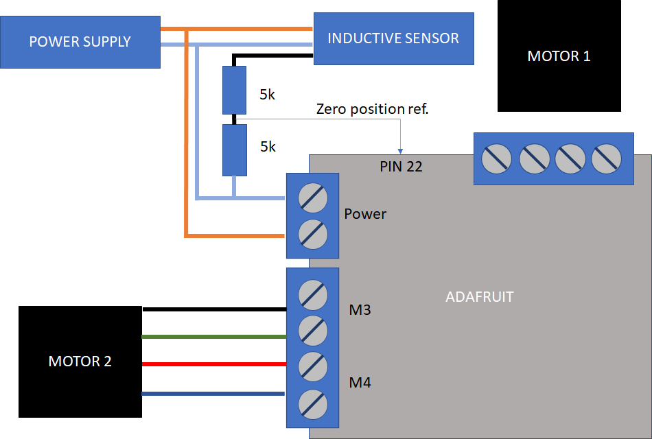

# Control of stepper motor with Arduino
The material needed for this project is:

* Arduino Mega or Arduino Uno.
* Adafruit MotorShield v2.3: DC Motor Stepper and Servo Control for Arduino.
* Power supply 0-30V 3A.
* An inductive sensor.
* 2 x 5k resistors.
* A protoboard.
* Some wires with arduino pin connection (male-male)

## 1. INSTALLATION.
We have to install in the Arduino IDE the library for the Motorshield Adafruit shield. For that, we can download from the next [link](https://github.com/adafruit/Adafruit_Motor_Shield_V2_Library/archive/master.zip).

Install also the **Adafruit BusIO**, using the library searcher implemented on arduino IDE

## 2. ELECTRONIC CONNECTIONS.
This shield is able to connect until two steppers motors or 4 DC motors 
with 1.2A per motor (3A max.)

In our case, we make the program two work with two motors.

### 2.1. Connection of the stepper motor. 

We supply the motor with 7 V and max 2 A.

The connection of motor wires are:

* In M3 input, black and green.
* In M4 input, red and blue.

We should connect a extern power supply for this motor, in the VIN jumper input of the motor shield.

Morevover, we have to connect the Midatec inductive sensor to pin 22. It has a pnp output. For that, we have to put a tension divider by 2, two reduce the 10 V output. For that we put two impedances in series each other, so we can get the 5 volts for the input of the Arduino digital input. 

### 2.2. Arduino Mega digital inputs 

The input mapping variables for the arduino are:

* **DIGITAL INPUT**: 22, RESET INDUCTIVE SENSOR FOR THE MOTOR 2
* **DIGITAL INPUT**: 24, RESET INDUCTIVE SENSOR FOR THE MOTOR 1 (optional)

For manual control of the motor 2, we have implement a simple circuit with two pulsers, and with a pull dowon configuration:

* **DIGITAL INPUT**: 24, UP PULSER MANUAL MOTOR CONTROL (optional)
* **DIGITAL INPUT**: 25, DOWN PULSER MANUAL MOTOR CONTROL(optional)

## 3. RS-232 COMMUNICATION PROTOCOL.

We use serial port events for communicate with the Arduino. For testing, we use the Serial Monitor of the Arduino IDE.

|COMMAND|DESCRIPTION|
|:-----:|:---------:|
|**POSITION1:**|the motor 1 will go to a indicated position|
|**POSITION2:**|the motor 2 will go to the indicated position|
|**POSITION:**|the motor 1 and 2 will go to the indicated position|
|**GOTORESET1**|the motor 1 goes to the assigned reset position|
|**GOTORESET2**|the motor 2 goes to the assignes reset position|
|***IDN?**|the arduino send the info of the arduino program.|
|**VEL?**|return the value of the velocity of the motors.|
|**VEL:**|set the velocity to a given value|
|**OFFSET1:**|set the velocity to a given value|
|**OFFSET2:**|set the velocity to a given value|
|**OFFSET?**|set the velocity to a given value|

We can compile two **.ino** files:
* **ControlMotorMicrostep**, that works with microsteps (seems, but not really)
* **ControlMotorSingle**, that works with single steps 

## 4. PYTHON SCRIPT.
The control of the system will be in hands of the PC via RS-232. For that we use Pyserial. For intall it we have to execute:

`pip install pyserial`

The script to test the functions to control the motor 2 is `serialcommunication.py`, that we can execute with:

`python serialcommunication.py`